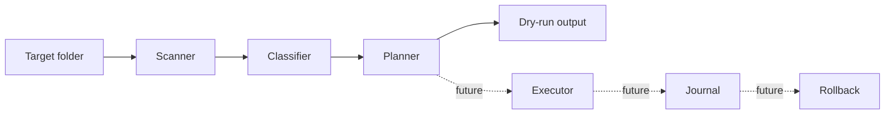

# Architecture

## 总览

项目采用分层设计：扫描、分类、计划、执行和审计彼此分离。当前仓库只实现了扫描、分类和计划生成的最小版本。

## 模块边界

### Scanner

负责枚举候选文件。

- 输入：根目录、是否递归、是否包含隐藏文件。
- 输出：候选文件路径。
- 不做分类，不写文件。

### Classifier

负责判断文件类别。

- 当前按扩展名分类。
- 未来支持规则文件、日期、路径模式、内容摘要。
- 输出必须包含可解释原因。

### Planner

负责生成计划。

- 将源路径映射到目标路径。
- 处理目标文件名冲突。
- 跳过已经位于目标位置的文件。
- 不执行移动。

### Executor

未来模块，负责执行计划。

- 执行前写 journal。
- 使用原子或尽可能安全的移动策略。
- 遇到错误时保留可诊断状态。

### Journal

未来模块，记录每个动作。

- 源路径。
- 目标路径。
- 时间。
- 文件大小和哈希。
- 操作结果。
- 回滚所需信息。

## 数据模型

当前核心模型是 `PlanItem`：

- `source`: 原文件路径。
- `destination`: 计划目标路径。
- `category`: 分类结果。
- `reason`: 分类原因。

## 安全策略

- 默认 dry-run。
- 不覆盖文件。
- 不删除文件。
- 不修改隐藏文件，除非用户明确传入参数。
- 执行能力必须等待 journal 设计落地后再加入。

