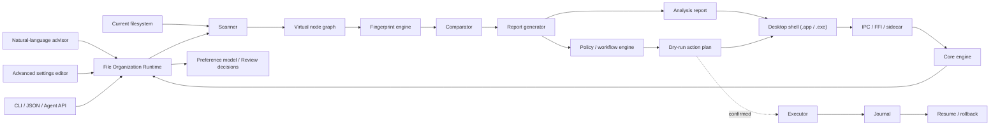

# Architecture

## 总览

项目采用分层设计：控制层、File Organization Runtime、扫描、虚拟文件系统、指纹、比较、报告、策略、工作流、执行和审计彼此分离。当前仓库只实现了扫描、分类和计划生成的最小 CLI spike，后续核心模型应按 [PLAN.md](../PLAN.md) 和 [RUNTIME.md](RUNTIME.md) 重新设计。

## 模块边界

### Desktop Shell

负责 macOS `.app` 和 Windows `.exe` 的桌面界面。

- 展示专业分析报告。
- 展示 equal/similar 分组。
- 展示证据、置信度、风险等级。
- 管理规则配置。
- 提供暂停、恢复、确认和导出入口。

桌面 shell 不直接承担核心文件系统逻辑。扫描、hash、容器解析、journal 和执行动作必须在 core engine 中完成。

测试版可以使用 Python + PySide6。正式版方向是 Flutter desktop UI + Rust core engine。

UI 与 core engine 的通信方式可以是 IPC、FFI 或 sidecar process。协议必须可版本化，并能表达：

- 任务启动、暂停、恢复和取消。
- 扫描进度。
- 专业分析报告。
- dry-run action plan。
- 用户确认。
- 风险等级。
- 可恢复错误。
- journal 状态。

UI 不直接执行扫描、hash、容器遍历、删除、移动或覆盖。

### Core Engine

负责所有核心文件系统和分析行为。

- 扫描真实文件系统。
- 管理 virtual node graph。
- 计算指纹和 hash。
- 解析容器 manifest。
- 执行比较策略。
- 生成报告和 dry-run 计划。
- 写入 journal。
- 执行已确认的复制、移动、重命名、删除或回滚。

Core engine 必须可以脱离 GUI 独立运行，以支持 CLI、自动化测试和未来 UI 替换。

### File Organization Runtime

Runtime 是判定与执行语义的权威。AI、settings、CLI、agent API 和 GUI 都必须通过 runtime 表达意图，不能各自实现一套判断逻辑。

Runtime 负责：

- 执行 runtime policy。
- 判断 `equal`、`similar`、`different`、`unknown`、`needs_more_analysis`。
- 决定 traversal policy：`atomic`、`manifest`、`shallow`、`recursive`、`custom`。
- 汇总 evidence、confidence、risk level。
- 生成 `AnalysisReport` 和 `SafePlan`。
- 决定何时 `require_confirmation`。
- 把执行动作写入 journal。

Runtime 不允许使用含糊的 best effort 作为结论。如果证据不足，必须输出不确定状态和下一步建议。

### Natural-Language Advisor

把基础用户的人话翻译成可见、可改、可撤销的规则草案。

AI advisor 不能绕过 runtime 直接执行整理动作。它只能：

- 解释用户偏好。
- 生成 policy 草案。
- 解释草案影响。
- 标注风险。
- 请求用户确认。

### Advanced Settings Editor

给高级用户直接配置 runtime policy。

它应该暴露：

- equal predicates。
- similar predicates。
- traversal policies。
- risk thresholds。
- workflow templates。
- exclude/protect rules。

自然语言生成的规则和 settings 里手写的规则最终进入同一套 runtime policy。

### Preference Model / Review Decision Store

“懂你”通过可审计的数据结构实现。

Preference Model 记录：

- 用户如何判断 equal/similar。
- 用户倾向保留什么版本。
- 用户对格式、路径、项目和容器的偏好。
- 用户对风险等级的容忍度。

Review Decision Store 记录用户确认或拒绝过的判断。

这些数据不能被当作当前文件系统状态的权威 cache。它们只描述用户判断标准和历史偏好。

### Scanner

负责读取当前文件系统，枚举候选节点。

- 输入：根目录、排除规则、扫描预算、递归策略。
- 输出：当前观察结果和可恢复分析任务。
- 不做最终分类，不执行写入。
- 每次重启都应重新读取当前文件系统，而不是相信旧缓存。

### Virtual Filesystem Adapter

负责把目录和容器文件统一抽象成节点树。

目标支持：

- 普通目录。
- ZIP、CAB、7z、RAR、tar、ISO。
- 容器作为原子文件。
- 容器作为可展开虚拟文件夹。

每个 adapter 必须声明 listing、读取、递归、成本和失败模式。

### Fingerprint Engine

负责生成多层级指纹。

- Metadata fingerprint。
- Partial hash。
- Full content hash。
- Archive manifest fingerprint。
- Recursive tree fingerprint。
- Media perceptual fingerprint。
- AI summary fingerprint。

指纹按需生成，不无脑计算最昂贵版本。

### Comparator

负责比较两个节点。

输出：

- `equal`
- `similar`
- `different`
- `unknown`
- `needs_more_analysis`

每个结果必须包含证据、策略、置信度和下一步建议。

### Report Generator

负责把观察结果、指纹、比较结果和 AI 建议汇总成专业分析报告。

报告是独立产物，不要求继续生成整理计划。

报告应该支持：

- 完全相等文件组。
- 高度相似文件组。
- 建议保留项。
- 低质量或冗余副本候选。
- 容器、安装镜像、游戏版本包和软件包的相似性摘要。
- 证据、置信度、风险等级。
- 需要人工确认或追加分析的项目。

### Planner

负责把比较结果和 workflow 决策转换成 dry-run 计划。

- 将候选动作表达成可审核计划。
- 处理目标文件名冲突。
- 标注风险等级和回滚要求。
- 不执行移动。

### Policy / Workflow Engine

负责用户定义的相等、相似、排除、容器展开和动作策略。

它应该提供模板，但允许用户复制和修改。

示例模板：

- 精确重复文件清理。
- 相似图片保留高质量版本。
- 压缩包 manifest 比较。
- 安装镜像按原子处理。
- 保守人工审核。

### Executor

未来模块，负责执行计划。

- 执行前写 journal。
- 使用原子或尽可能安全的移动策略。
- 遇到错误时保留可诊断状态。

### Journal

记录任务进度、检查点和实际动作。

- 源路径。
- 目标路径。
- 执行前提。
- 执行前后指纹。
- 触发 workflow。
- 用户确认来源。
- 操作结果。
- 回滚所需信息。

Journal 是恢复和审计工具，不是文件系统状态的权威缓存。

## 数据模型

当前 spike 的核心模型是 `PlanItem`：

- `source`: 原文件路径。
- `destination`: 计划目标路径。
- `category`: 分类结果。
- `reason`: 分类原因。

下一阶段需要引入：

- `NodeRef`: 真实文件或虚拟容器节点。
- `Observation`: 某次扫描看到的事实。
- `Fingerprint`: 多层级指纹。
- `AnalysisTask`: 可恢复任务。
- `ComparisonResult`: equal/similar/different/unknown/needs_more_analysis。
- `AnalysisReport`: 可独立保存和阅读的分析报告。
- `RuntimePolicy`: 编译后的规则和 workflow。
- `Preference`: 用户偏好。
- `ReviewDecision`: 用户历史判断。
- `SafePlan`: 可解释、可回滚、待确认的整理计划。

## 平台策略

- macOS 和 Windows 都是一等平台。
- 最终交付物必须包含 macOS `.app` 和 Windows `.exe` / installer。
- 打包、签名、installer、macOS notarization 和升级路径属于产品需求，不是发布末尾的临时脚本。
- Windows 开发环境按 MSYS2 + zsh 设计，不以 PowerShell 作为主要 shell。
- 应用仍需支持原生 Windows 路径、大小写不敏感文件系统、Windows 保留名和长路径。
- 路径处理必须使用标准路径 API，不手写分隔符。
- 不把浏览器或 WebView 权限模型作为默认路线。
- 不把 POSIX-only 命令或 macOS-only 权限行为作为唯一实现依据。

## 权限模型

权限设计需要区分动作风险，而不是粗暴地“拿到一个目录就什么都能做”。

- 只读扫描：读取目录树、metadata、必要时读取文件内容或容器 manifest。
- 报告导出：写入用户选择的报告路径。
- 低风险写入：复制到明确目标位置。
- 中风险写入：移动或重命名。
- 高风险动作：删除、覆盖、合并。

Documents、Desktop、Downloads、外接硬盘和网络盘都需要明确处理：

- 用户授权入口。
- 权限丢失后的恢复。
- 路径不可用时的错误信息。
- journal 和报告中记录授权上下文。
- 执行危险动作前重新验证权限和文件状态。

## 安全策略

- 默认 dry-run。
- Analysis-only / report-only 是安全的默认出口之一。
- 不覆盖文件。
- 不删除文件。
- 不修改隐藏文件，除非用户明确传入参数。
- Level 3 以上动作必须有 journal。
- 执行前重新验证文件状态。
- 容器深度分析必须受预算和策略限制。
- AI 只能建议，不能直接决定删除、覆盖或合并。
